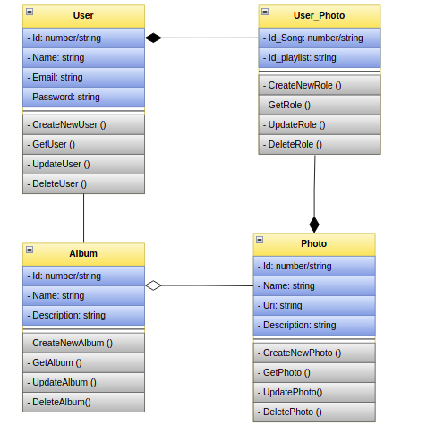

# Api-rest de Unsplash-image

## Aqui se muestr como correr el servidor

---

## Diagrama de clases

--- 

## Casos de uso

### Crear un usuario

### Iniciar sesion de un usuario

### Crear una foto

### Obtener una foto

### Obtener una lista de fotos

### Actualizar una foto

### Eliminar una foto
